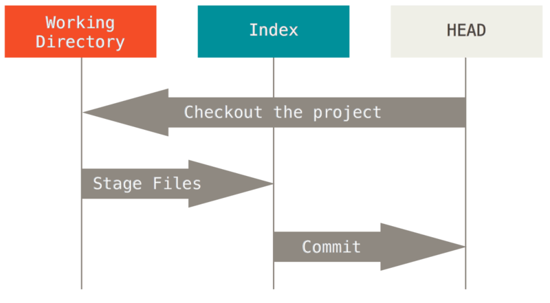

# GIT & GITHUB
[1장. 깃 환경 설정하기 - [git config]](#1장-깃-환경-설정하기)    
[2장. 깃 저장소 만들기에서 커밋까지 - [mkdir, cd, git init, git add ., git commit -am]](#2장-깃-저장소-만들기에서-커밋까지)   
[3장. 깃 브랜치 사용하기 - [git branch, git init, git log --oneline --all --graph]](#3장-깃-브랜치-사용하기)  
[4장. 다양한 merge 방법 - [git merge --squash, rebase, cherry-pick,  git branch  -d] ](#4장-다양한-merge-방법)  
 

## 1장. 깃 환경 설정하기

### CMD에 환경설정하기

- git config —global [user.name](http://user.name) “Do-Hyun,Kim” //이름
- git config —global [user.email](http://user.email) “dohyun911@hanmail.net” //이메일
- cat ~/.gitconfig  //이름, 이메일 입력 확인하기
 

## 2장. 깃 저장소 만들기에서 커밋까지

### 깃의 워크플로

 

### 새 디렉토리 만들기  
  
- `mkdir 새 디렉토리명 //이름을 만들면 vs작업폴더 내에 폴더 생성이 됨`
  - `직접 vs작업폴더 내에 새폴더를 만들고 init해도 됨`
 

### 디렉토리로 이동할 때  
  
- `cd 디렉토리명 //디렉토리로 이동할 때`
 

### 현재 디렉토리에서 깃을 사용할 수 있도록 초기화(디렉토리 만들고 초기화)
  
- `git init //초기화`
 

### 파일 staging하기
  
- `git add 파일명 또는 git add . //staging, ( .앞에 한 칸 띄어쓰기 주의), . = *(와일드카드)`
 

### 커밋하기  
  
- `git commit -m “메세지명” //커밋하기`
- git commit -am “메세지명” //staging+커밋하기, 한번이라도 커밋해야지 사용가능`
 

### 커밋한 파일이 어떻게 다른지 확인하기
  
- `git diff`
- `git difftool // J,K로 스크롤, :q로 종료`
- `git log --oneline --all ⇒ git difftool 커밋아이디 //커밋아이디 두 개까지 가능`
- `플러그인 git graph프로그램 설치하기`
 

### 상태 확인하기(영향가지 않으므로 아무때나 사용가능)  
  
- `git status`
- `git log`
- `git log --stat`
 

## 3장. 깃 브랜치 사용하기

### 개념정리

- 브랜치:  데이터의 흐름을 가리키는 말
- HEAD: 작업중인 브랜치를 가리키는 포인터, 가장 최신 커밋
 

### 기본브랜치 이름명을 main으로 바꾸기
  
- `git branch -M main //기본 브랜치명을 main으로 바꾸기`
 

### 브랜치 만들기
  
- `git branch 브랜치명 //브랜치 생성`
 

### 브랜치로 이동
  
- `git switch 브랜치명 //브랜치로 이동`
 

### 새 파일 만들기 한 후, 브랜치명 확인하기
  
- `git status  또는  git branch//브랜치명 확인하기, *표시있는 것이 현재 작업하는 브랜치`
 

### 파일 스테이징하기
  
- `git add . // . = *(와일드카드), .앞에 한칸 띄어쓰기 주의`
 

### 커밋하기
  
- `git commit -m “메세지명”`
 

### 메인 브랜치로 가기 (예전에는 git checkout을 썼음 이젠 잘 안씀)

- `git switch main`
 

### 브랜치를 한눈에 볼 때

- `git log --oneline --all --graph`
 

### 브랜치를 합칠 때 (우선 main브랜치로 가야함)

- `git switch main //우선 main브랜치로 가야함`
- `git merge 브랜치명 //합칠 브랜치명 입력`
- `코드고치고 - git add - git commit //충돌이 일어날 경우`
 

## 4장. 다양한 merge 방법

### merge와 rebase의 차이점

- merge: `branch`를 통합
- rebase: branch의 `base`를 옮기는 것  
 

사용하는 상황예시  
A 상황) 작업 브렌치가 하나로 통합되기에 커밋이 과하게 많아서 합쳐질 경우 각 커밋 단계를 가지는거 보다 가독성이 떨어짐 => `merge`
B 상황) 작업 브렌치에 커밋이 적당히 있어 합쳐져도 읽을만한 가독성이 유지되기 때문에 깔끔한 커밋 히스토리를 남기고 싶음 => `rebase`
 

